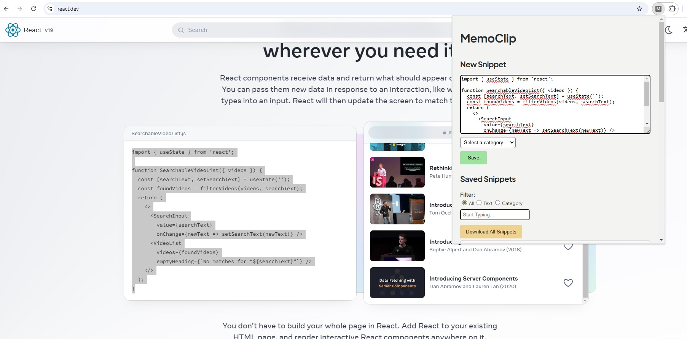
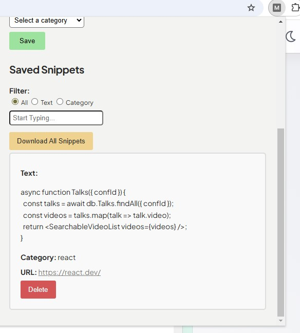

# chrome-extension-snippet-saver

A simple and efficient Chrome extension for saving text snippets from any webpage, categorizing them, and keeping track of important information. The extension allows users to organize saved snippets by category and even export them into a .txt file for offline reference. Ideal for developers, writers, and anyone needing to quickly save and manage snippets of text while browsing.

Features:
* Save and categorize text snippets from webpages.
* Automatically saves the URL for easy reference.
* Search and filter saved snippets by text or category.
* Download all snippets as a .txt file.
* User-friendly and lightweight extension for better productivity.

